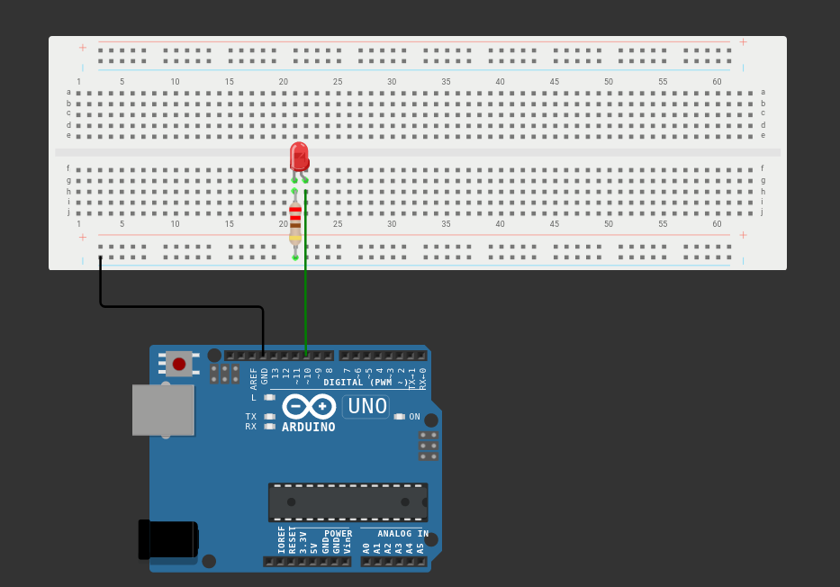

# bare-metal-blinking-led
Simple bare-metal version of a blinking LED. Written in C for the ATmega328P.

[Wokwi](https://wokwi.com/projects/352776710135067649) can be accessed for a simulation.

## Circuit Diagram

